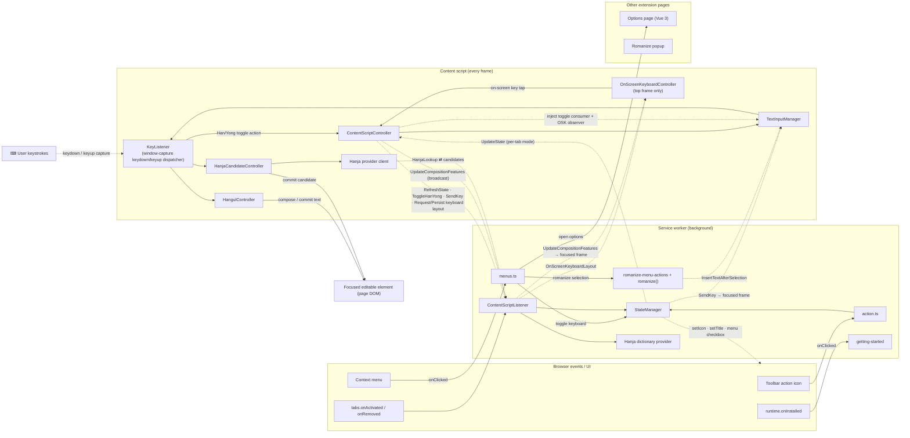
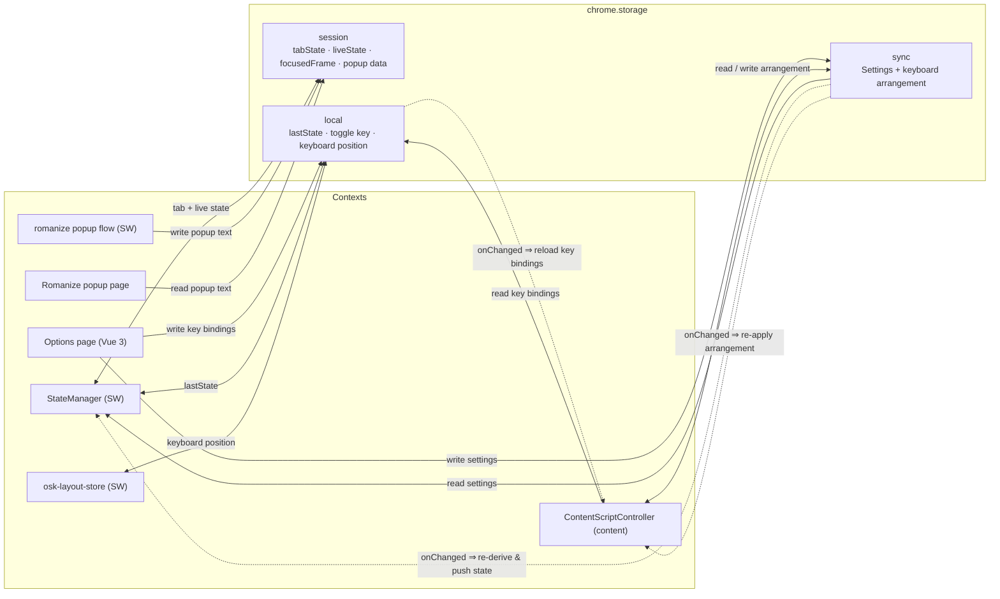
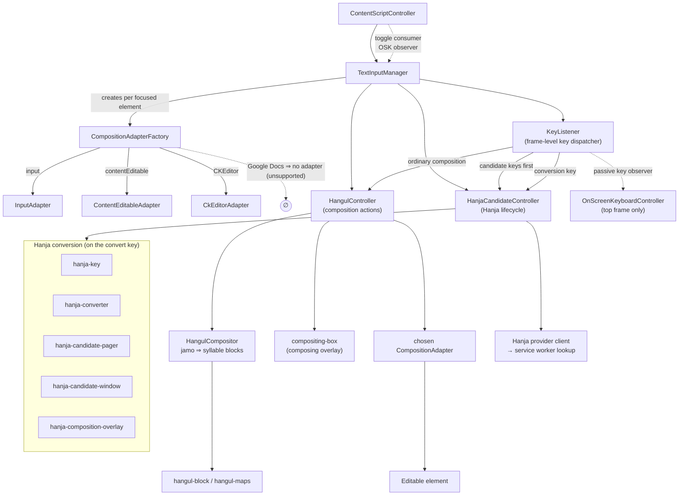

# Architecture

How the pieces of the extension fit together. For the prose version of this, see
[`AGENTS.md`](AGENTS.md); this file is the picture.

The extension runs in three live contexts — the **service worker** (background),
a **content script** injected into every frame, and the **options page** (plus a
small **romanize popup** window). They never call each other directly: they talk
over typed `chrome.runtime` messages and react to shared `chrome.storage`.

## 1. Messaging between contexts

The runtime message channels, the browser events that drive the service worker,
and the path a keystroke takes through the content script.

Notes:

- **Only the top frame hosts the on-screen keyboard.** Sub-frames run the IME but
  no keyboard. A key tapped on the OSK is tried locally first; if the focused
  editable lives in another frame, the service worker routes it there as a
  `SendKey` (using the recorded *focused frame*).
- **`KeyListener` is the content-script physical-key attach point.** It owns the
  frame's `keydown`/`keyup` listeners on `window` capture. `ContentScriptController`
  injects the Han/Yong toggle action; the OSK injects passive key-highlight
  feedback; Hangul and Hanja are swapped per focused editable by
  `TextInputManager`.
- **`UpdateCompositionFeatures` is a broadcast.** A frame reports which
  composition features its focused element supports; the service worker relays it
  to the tab so the (top-frame) keyboard can enable/disable keys.
- **Hanja lookup is a request/response round-trip.** The dictionary lives in the
  service worker; the content-script `HanjaDictionaryProviderClient` sends the
  complete Hangul run and receives the leftmost-longest match plus its candidates.

## 2. Shared state via `chrome.storage`

There is **no** options → service-worker message. The options page only *writes*
storage; every other context subscribes to `storage.onChanged` and reacts. The
write is the broadcast.

- **`sync`** — the user's `Settings` (incl. the keyboard's key arrangement).
  Roams across devices.
- **`local`** — per-device things: the remembered `lastState` (for "keep last
  state"), the **key bindings** (the Han/Yong toggle key and the Hanja conversion
  key), and the keyboard's pixel **position** per site. These are device-specific,
  so they deliberately don't roam.
- **`session`** — per-tab runtime state (`tabState-<id>`), the global `liveState`
  new tabs inherit, the `focusedFrame-<id>` used to route keys, and the handed-off
  romanize **popup text**. Cleared on browser close.

## 3. Content-script composition pipeline

Inside the content script, the IME core (mostly pure, well unit-tested) turns
keystrokes into Hangul and, on demand, Hanja.

- **`TextInputManager`** owns the active editor route: one `HangulController`, one
  `HanjaCandidateController`, and the chosen `CompositionAdapter` for the focused
  element. It also owns the frame-level `KeyListener`, pointing it at the active
  route as focus moves. **Google Docs gets no adapter** and is unsupported.
- **`KeyListener`** is pure dispatch for physical keys. In the content-script
  runtime it is the only `keydown`/`keyup` listener owner: candidate-window keys
  get first claim, then the Hanja conversion key, then the injected Han/Yong
  toggle consumer, then ordinary Hangul composition. Observers such as OSK key
  highlighting run passively and never consume keys.
- **`CompositionAdapterFactory`** picks the editor adapter (plain input,
  contentEditable, CKEditor) and reports which composition methods the editor
  supports.
- **`HangulCompositor`** is the heart: it assembles jamo into syllable blocks.
- **`HanjaCandidateController`** owns the whole Hanja conversion lifecycle —
  whether a key starts a conversion, the service-worker dictionary lookup (via the
  client), and the candidate window, pager, and overlay. `KeyListener` offers it
  each keydown. It's deliberately independent of Han/Yong mode, so
  it converts existing Hangul (including text typed by the OS IME) even while our
  Hangul typing is off.
- **The romanize popup is a separate extension page.** It uses the same
  composition pieces with a fixed editable (`KeyListener.forElement(...)`), while
  the options page's key-binding capture listeners are separate UI, not part of
  the content-script physical-key dispatcher.
